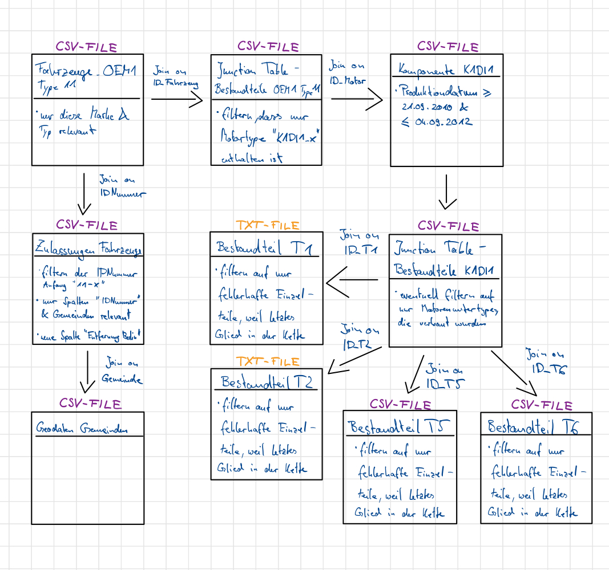

```{r setup, include=FALSE}
knitr::opts_chunk$set(echo = TRUE)
```

# Include Packages
```{r}
if (!require(install.load)){
  install.packages("install.load")
}
library(install.load)
install_load("tidyverse", "geosphere")
```

# Load the required datasets for the analysis

Our approach divided into several step in order to select the relevant data sets to answer our analysis question:
1. Step: We read our problem statement to obtain a deeper understanding of the task at hand
2. Step: After the initial read through, we highlighted import variable, which will affect our analysis:
         a. Problematic vehicle type => Type 11
         b. Installed engine => K1DI1
         c. Production date >= 21.09.2010 & <= 04.09.2012
         d. User-defined radius of max. 80km around Berlin for registered cars
         e. Defective vehicle = Each individual part OR component OR entire vehicle is marked as defective
3. Step: Obtaining an initial local overview of the provided files to get familiar with the file structure
4. Step: Selecting the relevant data sets for our analysis:
         a. Data tables
            - Fahrzeug_OEM1_Typ11.csv => Problematic vehicle type
            - Komponente_K1DI1.csv => Installed engine
            - Einzelteil_T01.txt => Individual part of installed engine
            - Einzelteil_T02.txt => Individual part of installed engine
            - Einzelteil_T05.csv => Individual part of installed engine
            - Einzelteil_T06.csv => Individual part of installed engine
            - Zulassungen_alle_Fahrzeuge.csv => All registered cars
            - Geodaten_Gemeinden_v1.2_2017-08-22_TrR.csv => Lat & Long for the regions in which the cars where registered
         b. Junction tables
            - Bestandteile_Fahrzeuge_OEM_Typ11.csv => Problematic vehicle type
            - Bestandteile_Komponente_K1DI1.csv => Installed engine
5. Step: Identifying the connections between the different tables + possible data size optimization based on the highlighted variable and relationships
{width:80%}
6. Step: Since we are only working with flat files (CSV & TXT), we load the identified data sets with the R package "readr" (included in the R package "tidyverse") to increase speed and efficiency

```{r}
# Creating a path variable to import the multiple data sets more easily
path <- "/Users/ericschrappe/Documents/Uni/Master/TU-Berlin/4. Semester/Introduction to Data Analytics/Case_Study"

# Improvements
# 1. Check the separator before loading the entire data set


# Relevant CSV file for the identified vehicle type
rval_vehicle_data <- read_csv(file.path(path, "Data/Fahrzeug/Fahrzeuge_OEM1_Typ11.csv"), col_names= TRUE, trim_ws= TRUE) %>% 
  select("ID_Fahrzeug", "Fehlerhaft")

# Junction table for relationship between vehicle and component
# Based on problem statement, table size and number of dimensions was reduced to save memory space
junction_table_vehicle <- read_csv2(file.path(path, "Data/Fahrzeug/Bestandteile_Fahrzeuge_OEM1_Typ11.csv"), col_names=TRUE, trim_ws= TRUE) %>% 
  select("ID_Motor", "ID_Fahrzeug") %>% 
  filter(str_detect(ID_Motor, "^K1DI1"))

# Relevant CSV file for the identified component type
# Structure of the table needed to be adjusted since each unique column was repeated after a certain amount of observations
# Each row included one complete observation and NAs for remaining columns
# In addition, only the specified time range was selected
rval_component_data <- read_csv(file.path(path, "Data/Komponente/Komponente_K1DI1.csv"), col_names=TRUE, trim_ws= TRUE) %>% 
  mutate(ID_Motor = coalesce(ID_Motor.x, ID_Motor.y, ID_Motor)) %>%
  mutate(Produktionsdatum = coalesce(Produktionsdatum.x, Produktionsdatum.y, Produktionsdatum)) %>%
  mutate(Herstellernummer = coalesce(Herstellernummer.x, Herstellernummer.y, Herstellernummer)) %>%
  mutate(Werksnummer = coalesce(Werksnummer.x, Werksnummer.y, Werksnummer)) %>%
  mutate(Fehlerhaft = coalesce(Fehlerhaft.x, Fehlerhaft.y, Fehlerhaft)) %>%
  mutate(Fehlerhaft_Datum = coalesce(Fehlerhaft_Datum.x, Fehlerhaft_Datum.y, Fehlerhaft_Datum)) %>%
  mutate(Fehlerhaft_Fahrleistung = coalesce(Fehlerhaft_Fahrleistung.x, Fehlerhaft_Fahrleistung.y, Fehlerhaft_Fahrleistung)) %>%
  select("ID_Motor", "Produktionsdatum", "Fehlerhaft") %>% 
  filter(Produktionsdatum >= "2010-09-21" & Produktionsdatum <= "2012-09-04")

# Junction table for relationship between component and individual part
junction_table_component <- read_csv2(file.path(path, "Data/Komponente/Bestandteile_Komponente_K1DI1.csv"), col_names=TRUE, trim_ws= TRUE) %>% 
  select(-c(...1))

# Relevant files for individual parts
# Need to increase the size of the connection buffer in order to load the TXT-file properly

#Sys.setenv("VROOM_CONNECTION_SIZE" = "999999999")

#txt einlesen mit line break symbol

txt_t1 <- readLines(file.path(path, "Data/Einzelteil/Einzelteil_T01.txt"))
txtNew_t1 <- gsub(x = txt_t1, pattern = "\\s\\|\\s\\|\\s", replacement = ",")
txtNew_t1 <- gsub(x = txtNew_t1, pattern = "\\s", replacement = "\n")
txtNew_t1 <- substring(txtNew_t1, 1, nchar(txtNew_t1)-1)

rval_part_t1 <- read_delim(I(txtNew_t1), delim = ",", trim_ws = TRUE) 

rm(txt_t1, txtNew_t1)

txt_t2 <- readLines(file.path(path, "Data/Einzelteil/Einzelteil_T02.txt"))
txtNew_t2 <- gsub(x = txt_t2, pattern = "\t\"[0-9]+\"\\s", replacement = "\n")
txtNewe_t2 <- gsub(x = txtNew_t2, pattern = "\n\\s", replacement = "\n")
txtNewer_t2 <- gsub(x = txtNewe_t2, pattern = "[ \t]+", replacement = ",")
txtNewer_t2 <- substring(txtNewer_t2, 1, nchar(txtNewer_t2)-1)

rval_part_t2 <- read_delim(I(txtNewer_t2), delim = ",", trim_ws = TRUE) %>% 
  select("ID_T02.x", "ID_T02.y", "Fehlerhaft.x", "Fehlerhaft.y") %>% 
  mutate(ID_T02 = coalesce(ID_T02.x, ID_T02.y)) %>% 
  mutate(Fehlerhaft = coalesce(Fehlerhaft.x, Fehlerhaft.y)) %>%
  select("ID_T02", "Fehlerhaft") %>%
  filter(Fehlerhaft == 1)

rm(txt_t2, txtNew_t2, txtNewe_t2, txtNewer_t2)

rval_part_t5 <- read_csv(file.path(path, "Data/Einzelteil/Einzelteil_T05.csv"), col_names=TRUE, trim_ws= TRUE) %>%
  select("ID_T05.x", "ID_T05.y", "Fehlerhaft.x", "Fehlerhaft.y") %>% 
  mutate(ID_T05 = coalesce(ID_T05.x, ID_T05.y)) %>% 
  mutate(Fehlerhaft = coalesce(Fehlerhaft.x, Fehlerhaft.y)) %>%
  select("ID_T05", "Fehlerhaft") %>%
  filter(Fehlerhaft == 1)

rval_part_t6 <- read_csv(file.path(path, "Data/Einzelteil/Einzelteil_T06.csv"), col_names=TRUE, trim_ws= TRUE) %>% 
  select("ID_T06", "Fehlerhaft") %>%
  filter(Fehlerhaft == 1)

# Relevant file for car registration
# Can filter the data to only include registrations for the vehicle type 11 & which were registered at least at the same day as the engine was produced
rval_car_registrations <- read_csv2(file.path(path, "Data/Zulassungen/Zulassungen_alle_Fahrzeuge.csv"), col_names=TRUE, trim_ws= TRUE) %>% 
  select(-c(...1, Zulassung)) %>% 
  filter(str_detect(IDNummer, "^11-"))

# Relevant file for geographical data
rval_geo_data <- read_csv2(file.path(path, "Data/Geodaten/Geodaten_Gemeinden_v1.2_2017-08-22_TrR.csv"), col_names=TRUE, trim_ws= TRUE) %>% 
  select(-c(...1, X, Postleitzahl))

# List of all variable to increase the efficiency for checking missing values
var_list <- list(vehicle = rval_vehicle_data,
                 junction_vehicle = junction_table_vehicle,
                 junction_component = junction_table_component,
                 components = rval_component_data,
                 parts_t1 = rval_part_t1,
                 parts_t2 = rval_part_t2,
                 parts_t5 = rval_part_t5, 
                 parts_t6 = rval_part_t6, 
                 geo_data = rval_geo_data,
                 car_registrations = rval_car_registrations)

rm(rval_vehicle_data, 
   junction_table_vehicle, 
   rval_component_data, 
   junction_table_component,
   rval_part_t1,
   rval_part_t2,
   rval_part_t5,
   rval_part_t6,
   rval_geo_data,
   rval_car_registrations)

```

# Perform Data Exploration on loaded data sets

a. Investigating missing values

1. Step: Check whether any column of the data sets includes missing values
2. Step: Investigate the columns with missing value if applicable
3. Step: Adjust the data sets if necessary


```{r}
# Function to check each column of the given data set for missing values
na_test <- function(x){
  
  missing_values <- sapply(x, function(col) any(is.na(col)))
  if(any(missing_values)){
    paste("There are missing values for in column: ", names(which(missing_values)))
  }else {
    paste("No columns with missing values")
  }
}

# 1. Step
# Applying missing value function to each of the variables
lapply(var_list, na_test)

# 2. Step
# Investigating tables with missing values
#vehicle_data_missing_values <- rval_vehicle_data[is.na(rval_vehicle_data$Fehlerhaft_Datum),]
#print.data.frame(head(vehicle_data_missing_values, 2))
#component_data_missing_values <- rval_component_data[is.na(rval_component_data$Fehlerhaft_Datum),]
#print.data.frame(head(component_data_missing_values, 2))
geo_data_missing_values <- var_list[["geo_data"]][is.na(var_list[["geo_data"]]$Gemeinde),]
print.data.frame(head(geo_data_missing_values, 10))

# => For the vehicle & component data, we observed that the missing values only occur when the vehicle / component isn't defective
# => Since these cases are still relevant for our analysis, we will keep them at this point of our analysis
# => Regarding the one missing value in the geo data table, we will exclude this observation from our analysis since it seems to not have a significant impact

# 3. Step
# Adjust data sets based on observations
var_list[["geo_data"]] <- var_list[["geo_data"]] %>% drop_na()


```

# Perform Data Exploration on loaded data sets

b. Investigating data types and potentially converting them

1. Step: Create a function that returns the data type for each column of the given dataframe
2. Step: Apply the previouly developed function to all relevatn dataframes
3. Step: Evaluate whether the data type of a column needs to be transformed


```{r}

# 1. Step
data_types <- function(x){
  sapply(x, class)
}

# 2. Step
lapply(var_list, data_types)

# => Most of the columns already are already available in the correct data type
# => However, to simplify the further analysis, we will convert the column "Fehlerhaft" of type "numeric" to type "logic" since it only provide us with the information whether a vehicle, component or part is defective and thereby a "logic" data type is better suited
# => In addition the lat and long values need to be adjusted to represent the actual coordinates

# 3. Step

## Convert logical data type
convert_data_type_logical <- function(dataframe){
  if("Fehlerhaft" %in% colnames(dataframe)){
    dataframe$Fehlerhaft <- as.logical(dataframe$Fehlerhaft)
  }
  return(dataframe)
}

var_list <- lapply(var_list, convert_data_type_logical)

# => Only use data from inside the list, because the updates are only reflected in their.

## Ensure that lat and long data is in right length
var_list[["geo_data"]]$Laengengrad <- as.numeric(format(var_list[["geo_data"]]$Laengengrad, digits = 8))
var_list[["geo_data"]]$Breitengrad <- as.numeric(format(var_list[["geo_data"]]$Breitengrad, digits = 8))


```
# Perform Data Exploration on loaded data sets

c. Remove potential duplicate data observations

1. Step: Create a function that determines whether duplicate exists in the datasets
2. Step: Apply the function to all relevant datasets
3. Step: Remove potential duplicates

```{r}

# 1. Step
duplicate_test <- function(dataframe){
  if(any(grepl("ID_", colnames(dataframe)))){
    if(sum(grepl("ID_", colnames(dataframe)), na.rm = TRUE) == 1){
      dataframe %>% 
        group_by(across(starts_with("ID_"))) %>% 
        summarise(Total = n()) %>% 
        filter(Total > 1)
    }else{
      dataframe %>% 
        group_by(dataframe[,1]) %>% 
        summarise(Total = n()) %>% 
        filter(Total > 1)
    }
  }else if(any(grepl("IDNummer", colnames(dataframe)))){
    dataframe %>% 
        group_by(IDNummer) %>% 
        summarise(Total = n()) %>% 
        filter(Total > 1)
  }else{
    dataframe %>% 
        group_by(Gemeinde) %>% 
        summarise(Total = n()) %>% 
        filter(Total > 1)
  }
}

lapply(var_list, duplicate_test)

# Only in the geo_data dataframe could we find duplicates, but here we used the column "Gemeinde" as an ID instead of an ID column
# These duplicates can be traced back to different postcodes for municipalities
# Since we only have the information about the municipalities in the car registration data and postcodes aren't relevant for our analysis, we can remove the duplicates of this dataframe

var_list[["geo_data"]] <- var_list[["geo_data"]] %>% distinct(Gemeinde, .keep_all = TRUE)

```

# Perform Data Exploration on loaded data sets

d. Trim the data

1. Step: Since some of the community names had numbers at the end of their name, they needed to be removed. This applies for the data sets "car registrations" as well as "geo data"


```{r}
# 1. Step
var_list[["car_registrations"]][["Gemeinden"]] <- gsub('[0-9]+', '', var_list[["car_registrations"]][["Gemeinden"]])

"HALLE" %in% var_list[["car_registrations"]][["Gemeinden"]]
"HALLE1" %in% var_list[["car_registrations"]][["Gemeinden"]]

var_list[["geo_data"]][["Gemeinde"]] <- gsub('[0-9]+', '', var_list[["geo_data"]][["Gemeinde"]])

"HALLE" %in% var_list[["geo_data"]][["Gemeinde"]]
"HALLE1" %in% var_list[["geo_data"]][["Gemeinde"]]
```


# Perform Data Exploration on loaded data sets

e. Graphs for the important features

1. Step: Create a function, which first checks whether the relevant information is included in the dataset, here the column "Fehlerhaft". Afterwards make sure to exclude all datasets where the unique number of observations = 1.
2. Step: Apply the created function the list of variables

```{r}
# 1. Step
plot_defective <- function(dataframe){
  if("Fehlerhaft" %in% colnames(dataframe)){
    if(length(dataframe[["Fehlerhaft"]]) != length(which(dataframe[["Fehlerhaft"]] == TRUE))){
      ggplot(dataframe, aes(x=Fehlerhaft)) +
      geom_bar() + 
      geom_text(aes(label=..count..), stat="count", vjust= 1.5, colour= "white")
    }
  }
}

# 2. Step
lapply(var_list, plot_defective)

```

# Creating a single dataset

1. Step: Join the junction table the respective data tables to obtain the ID relevant to join with other data tables
2. Step: Connect the smallest unit to the next higher unit, Parts => Components
3. Step: Join the component & part data with the vehicle data and create a column that indicates whether one of these units is defective
4. Step: Join the car registrations and geo data to obtain the geographical coordinates for the communities
5. Step: Bring everything together in one dataframe and calculate the distance between the communities and the center of Berlin (Long/Lat obtained from this website: https://www.umingo.de/deutschland/berlin/)


```{r}

# 1. Step
joined_vehicles <- var_list[["vehicle"]] %>% 
                    inner_join(var_list[["junction_vehicle"]], by= c("ID_Fahrzeug" = "ID_Fahrzeug"))

joined_components <- var_list[["components"]] %>% 
                      inner_join(var_list[["junction_component"]], by= c("ID_Motor" = "ID_K1DI1"), suffix= c("", "_junction"))

# 2. Step
## Don't forget to also join T1, T2
joined_components_parts <- joined_components %>% 
                              left_join(var_list[["parts_t5"]], by=c("ID_T5" = "ID_T05"), suffix=c("_component", "_T5")) %>% 
                              left_join(var_list[["parts_t6"]], by=c("ID_T6" = "ID_T06"), suffix=c("_component", "_T6")) %>% 
                              mutate(Fehlerhaft_T5 = replace_na(Fehlerhaft_T5, FALSE)) %>%
                              mutate(Fehlerhaft = replace_na(Fehlerhaft, FALSE))
# 3. Step                        
defective_vehicle_to_parts <- joined_vehicles %>% 
                                inner_join(joined_components_parts, by=c("ID_Motor" = "ID_Motor"), suffix=c("_vehicle", "")) %>% 
                                mutate(Defect = ifelse(Fehlerhaft_vehicle == TRUE, TRUE,
                                                       ifelse(Fehlerhaft_component == TRUE, TRUE,
                                                              ifelse(Fehlerhaft_T5 == TRUE | Fehlerhaft == TRUE, TRUE, FALSE))))

# 4.Step
car_registration_with_geo <- var_list[["car_registrations"]] %>% 
                              left_join(var_list[["geo_data"]], by= c("Gemeinden" = "Gemeinde"))

# 5. Step
entire_defective_data <- defective_vehicle_to_parts %>% 
                          inner_join(car_registration_with_geo, by = c("ID_Fahrzeug" = "IDNummer")) %>% 
                          mutate(Distance_KM = distHaversine(cbind(Laengengrad, Breitengrad), cbind(13.3777, 52.5162))/1000) 

#write_csv(entire_defective_data, file = "Final_dataset_group_25.csv")


 

```

