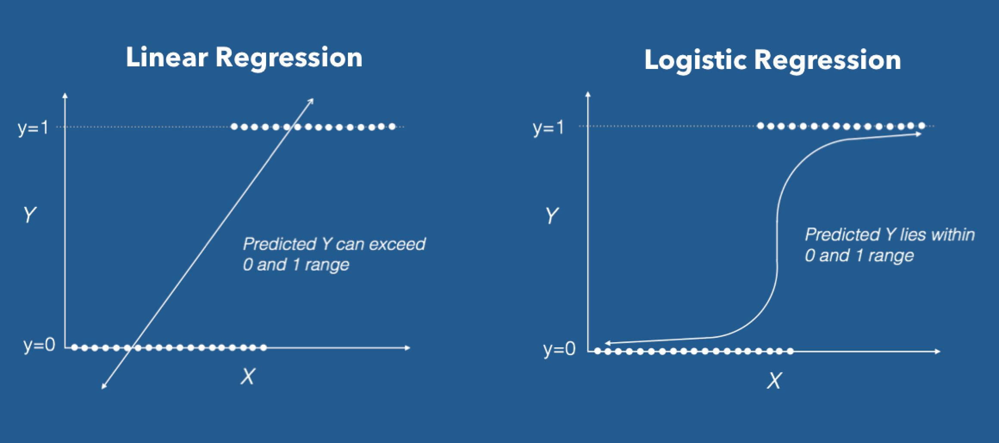

```{r setup, include=FALSE}
knitr::opts_chunk$set(echo = TRUE)
```

# Include Packages
```{r, , message = FALSE, echo = FALSE}
if (!require(install.load)){
  install.packages("install.load")
}
library(install.load)
install_load("tidyverse", "dplyr", "tidyr", "stringr", "readr", "knitr", "here", "ggplot2", "fitdistrplus", "purrr", "plotly", "lubridate")
print("Successfully loaded all packages!")
```


# Question 1

Logistics plays a more and more important role in the product development of the automobile industry. Parts produced by the supplier must first be delivered to the OEM before they can be installed. What seems logical at first sight should be analyzed in more detailed way for a professional application. Therefore, create a distribution for the logistics delay of component „K7”. Use the production date (“Produktionsdatum”) from the data set “Komponente_K7.csv” and the receiving date of incoming goods (“Wareneingang”) from “Logistikverzug_K7.csv” (logistics delay). You can assume that produced goods are issued one day after production date. For the model design in R, create a new data set “Logistics delay” that contains the required information from both data sets.

a) How is the logistics delay distributed? Justify your choice with statistical tests and briefly describe your approach.
```{r}
# Import data which includes production date
komponenten_k7 <- read.csv2(here("Data", "Logistikverzug", "Komponente_K7.csv"))

# Import data which includes receiving date
logistikverzug_k7 <- read.csv(here("Data", "Logistikverzug", "Logistikverzug_K7.csv"))

# Merge tables by IDNummber (id number) if rows equal
if(!nrow(komponenten_k7) == nrow(logistikverzug_k7)){
  print("Amount of rows unequal in Komponenten K7 und Logistikverzug K7")
  stop()
}else{
  big_table <- merge(komponenten_k7, logistikverzug_k7, by = "IDNummer")
  print("Merged 'Komponente_K7.csv' and 'Logistikverzug_K7.csv'")
}

# Convert both rows to POSIXct for timediff calculation and rename columns
logistics_delay <- data.frame(IDNummer=big_table$IDNummer,Produktionsdatum= as.POSIXct(big_table$Produktionsdatum),Wareneingang= as.POSIXct(big_table$Wareneingang))


#Add one day to Produktionsdatum <- "You can assume that produced goods are issued one day after production date"
logistics_delay$Produktionsdatum <- logistics_delay$Produktionsdatum + lubridate::days(1)


#Calculate Datediff without weekends -> help function
date_diff_excluding_wekeends <- function(x, y) {
  if(is.na(x) || is.na(y)) return(NA)
  return(sum(!format(seq(x, y-1, by = '1 day'), '%u') %in% 6:7))
}

#Vectorize function
date_diff_excluding_wekeends_V <- Vectorize(date_diff_excluding_wekeends)

#Mutate and calculate the Verzoegerung_in_Tagen ohne Wochenende
logistics_delay <- logistics_delay %>%
  mutate(Verzoegerung_in_Tagen=date_diff_excluding_wekeends_V(logistics_delay$Produktionsdatum, logistics_delay$Wareneingang))

#Check structure
#print(head(logistics_delay, 10))


#Plot the Table 
fig <- plot_ly(x = logistics_delay$Verzoegerung_in_Tagen, type = "histogram", nbinsx = 25, alpha=0.8) %>%
    layout(yaxis = list(title = "Anzahl der Teile"),
           xaxis = list(title = "Verspaetung in Tagen", tickmode='linear'),
           title="Plot: Verteilung der Verspaetung in Tagen") 

fig
```
b) Determine the mean of the logistics delay (watch out for weekends). Please interpret this number and discuss possible alternatives.
```{r}
sprintf("Die durschnittliche logistische Verzoegerung beträgt %s Tage", format(round(mean(logistics_delay$Verzoegerung_in_Tagen), 2), nsmall = 2))
```
**Interpretation: **
TODO

c) Visualize the distribution in an appropriate way by displaying the histogram and the density function using “plotly”. Please describe how you selected the size of the bins.
```{r}
print("TODO")
```
d) Please describe how you proceed, if you have to create a decision tree, which is describing the classification problem to classify whether the component (K7) is defective (Fehlerhaft) or not? (Hint: You might want to work with visualizations.)


Decision Tree with Machine Learning
In machine learning, classification refers to a predictive modeling problem where a class label is predicted for a given example of input data. In the component K7 we have the label "Fehlerhaft" and all input data, all columns except "Fehlerhaft. Classification requires a training dataset with many examples of inputs and outputs from which to learn. In the present case, we can use our existing data as a training dataset. A model will use the training dataset and will calculate how to best map examples of input data to specific class labels. As such, the training dataset must be sufficiently representative of the problem. The labels should be mapped to a numeric value, like '0' for 'Fehlerhaft' and '1' for 'Nicht Fehlerhaft'.There is no good theory on how to map algorithms onto problem types, instead, it is  recommended that a practitioner use controlled experiments and discover which algorithm and algorithm configuration results in the best performance for a given classification task. Classification predictive modeling algorithms are evaluated based on their results. 


Regarding our given data, we can have a closer look at the binary logistical regression classification, which typically measures the relationship between the categorical target variable and one or more independent variables. It is useful for situations in which the outcome for a target variable can have only two possible types (in other words, it is binary), like explained above, '0' and '1'. Not only does binary logistic regression allow you to assess how well your set of variables predicts your categorical dependent variable and determine the “goodness-of-fit” of your model as does regular linear regression, but also it provides a summary of the accuracy of the classification of cases, which helps you determine the percent of predictions made from this model/equation that will be correct.

The predicted Y (notating Yc) stands for the predicted probability that the result is a “1.” And, of course, a probability must be between 0 and 1 (or, 0–100%), by definition. In a “regular” simple linear regression, our regression line is

Yc = a + bX

So, in essence, we have a linear regression equation, or, if there are several X’s (up to n) like in our case:

Yc = a + b1X1 + b2X2 + ... + bnXn

The criterion of maximum likelihood estimation finds values of “a” and “b” that maximize the probability of obtaining the sample data you actually have. In R, after checking and cleaning our dataset, we can use the function glm(). glm() is used to fit generalized linear models, specified by giving a symbolic description of the linear predictor and a description of the error distribution. For the "formula" input, we can use "binominal" for binary logistical regression. 
It is common to model a binary classification task with a model that predicts a Bernoulli probability distribution for each example.The Bernoulli distribution is a discrete probability distribution that covers a case where an event will have a binary outcome as either a 0 or 1. For classification, this means that the model predicts a probability of an example belonging to class 1, or the abnormal state. This is illustrated in picture 1. 



The difference between the linear and the logistic regression is clear. Since we have two absolute values, 0 and 1 or 'Faulty' and 'Not Faulty', we have decided to use the logistic regression. Our Y thus defines the probability curve with which a part is 'Faulty' or 'Not Faulty'. If a value is calculated from the input data that is above the curve of Y, we conclude a 1 and the part would therefore not be faulty. On the other hand, if we are in the area below the curve, it is a 'Faulty' part, i.e. a 0. 


# Question 2

Why does it make sense to store the available data in separate files instead of saving everything in a huge table? Name at least four benefits. The available tables represent a typical data base structure. How is it called?

**Four Benefits: ** 

* **Accessibility: ** 
Structuring and storing data in separate files allows easier access and thus easier readability of the files. 
Compared to large data sets, the relevant information would have to be extracted. 
In the case of small files with adequate designations, the user has the possibility to read out the desired information in a targeted manner and to process it directly. This leads to the next benefit of performance. 

* **Performance / Operating time: ** 
By storing the files in small separate files, the access time to the files is significantly reduced. 
Reading or opening large files requires a lot of memory and operations of the computer. 
By dividing them into small files, it is possible to work with the files faster. 

* **Memory advantage: ** 
As announced in performance, reducing a large dataset to small seperate ones can also reduce storage space. 
Data sets that are not necessary or sensibly grouped can be swapped out or made accessible elsewhere, thus avoiding unnecessary memory consumption. 

* **Data integrity: ** 
Data integrity is the overall accuracy, completeness, and consistency of data. 
If unforeseen events or errors damage the integrity of the data, it is very costly to fix this in a large file. 
If separate files are used and integrity is violated there, the area to be processed is significantly limited. 
The small separate files can thus be recovered more quickly without the risk of violating new integrity in other data fields. 

**Typical database structure: ** 
Oracle defines relational databases as following. "A relational database is a type of database that stores and provides access to data points that are related to one another. Relational databases are based on the relational model, an intuitive, straightforward way of representing data in tables.In a relational database, each row in the table is a record with a unique ID called the key. The columns of the table hold attributes of the data, and each record usually has a value for each attribute, making it easy to establish the relationships among data points."
If we take a closer look at the datasets provided, we can understand the structure of the data relatively quickly.  As, for example, tasks 3 and 6 will show later, there are links between the individual data records, regardless of whether they are .txt or .csv files.  For example, in the list of registered cars we find a unique identifier, the key to work through the car's components on a smaller level.  These in turn contain unique identifiers to look at the individual parts of the components.
Consequently, there is a link between the data sets and it can be considered as a relational database.
Quelle: [Oracle](https://www.oracle.com/database/what-is-a-relational-database/)


# Question 3
How many of the parts T16 ended up in vehicles registered in Adelshofen?
````{r}
# Pull IDs for relevant parts
txt_t16 <- readLines(here("Data", "Einzelteil", "Einzelteil_T16.txt"))
txt_t16 <- paste('"ID" | |', txt_t16)
txt_t16 <- gsub(x = txt_t16, pattern = "\\s\\|\\s\\|\\s", replacement = ",")
txt_t16 <- gsub(x = txt_t16, pattern = "\\s", replacement = "\n")
txt_t16 <- substring(txt_t16, 1, nchar(txt_t16) - 1)
df_t16 <- read_delim(I(txt_t16), delim = ",", trim_ws = TRUE)
df_t16 <- dplyr::select(df_t16, -1)
rm(txt_t16)
ids_t16 <- df_t16$ID_T16.x
rm(df_t16)

# Pull data about relevant cars
alle_zulassungen <- read.csv2(here("Data", "Zulassungen", "Zulassungen_alle_Fahrzeuge.csv"))
adelshofen_zulassungen <- alle_zulassungen %>%
  filter(alle_zulassungen$Gemeinden == "ADELSHOFEN")

# Pull data about which cars contain which components
Bestandteile_Fahrzeuge_OEM1_Typ11 <- read.csv2(here("Data", "Fahrzeug", "Bestandteile_Fahrzeuge_OEM1_Typ11.csv")) %>% dplyr::select(-1)
Bestandteile_Fahrzeuge_OEM1_Typ12 <- read.csv2(here("Data", "Fahrzeug", "Bestandteile_Fahrzeuge_OEM1_Typ12.csv")) %>% dplyr::select(-1)
Bestandteile_Fahrzeuge_OEM2_Typ21 <- read.csv2(here("Data", "Fahrzeug", "Bestandteile_Fahrzeuge_OEM2_Typ21.csv")) %>% dplyr::select(-1)
Bestandteile_Fahrzeuge_OEM2_Typ22 <- read.csv2(here("Data", "Fahrzeug", "Bestandteile_Fahrzeuge_OEM2_Typ22.csv")) %>% dplyr::select(-1)
Bestandteil_Fahrzeuge <- rbind(Bestandteile_Fahrzeuge_OEM1_Typ11, Bestandteile_Fahrzeuge_OEM1_Typ12, Bestandteile_Fahrzeuge_OEM2_Typ21, Bestandteile_Fahrzeuge_OEM2_Typ22)
rm(Bestandteile_Fahrzeuge_OEM1_Typ11, Bestandteile_Fahrzeuge_OEM1_Typ12, Bestandteile_Fahrzeuge_OEM2_Typ21, Bestandteile_Fahrzeuge_OEM2_Typ22)

# First filter components that containt part T16 by looking at datasets
# Then importing relevant datasets
Bestandteile_Komponente_K2LE2 <- read.csv2(here("Data", "Komponente", "Bestandteile_Komponente_K2LE2.csv"))
Bestandteile_Komponente_K2ST2 <- read.csv2(here("Data", "Komponente", "Bestandteile_Komponente_K2ST2.csv"))
Bestandteile_Komponente_K2LE2 <- Bestandteile_Komponente_K2LE2 %>% dplyr::select(c("ID_T16", "ID_K2LE2")) %>% rename(ID_Komponente = ID_K2LE2)
Bestandteile_Komponente_K2ST2 <- Bestandteile_Komponente_K2ST2 %>% dplyr::select(c("ID_T16", "ID_K2ST2")) %>% rename(ID_Komponente = ID_K2ST2)
Bestandteile_Komponenten <- rbind(Bestandteile_Komponente_K2LE2, Bestandteile_Komponente_K2ST2)

# (Seem to have same data)
#Komponente_K2LE2 <- readLines(here("Data", "Komponente", "KOmponente_K2LE2.txt"))
#Komponente_K2LE2[1] <- paste0('"ID"\\', Komponente_K2LE2[1])
#Komponente_K2LE2 <- gsub(x = Komponente_K2LE2, pattern = "\\s", replacement = "")
#Komponente_K2LE2 <- read_delim(I(Komponente_K2LE2), delim = "\\", trim_ws = TRUE)
#Komponente_K2ST2 <- read.csv2(here("Data", "Komponente", "Bestandteile_Komponente_K2ST2.csv"))

Autos_mit_T16 <- adelshofen_zulassungen %>%
  merge(Bestandteil_Fahrzeuge, by.x = "IDNummer", by.y = "ID_Fahrzeug") %>%
  merge(Bestandteile_Komponenten, by.x = "ID_Sitze", by.y = "ID_Komponente") %>%
  filter(ID_T16 %in% ids_t16)

Unique_Autos_mit_T16 <- unique(Autos_mit_T16$IDNummer)

Anzahl_Unique_Autos_mit_T16 <- length(Unique_Autos_mit_T16)

sprintf("Es wurden %s Autos in Adelshofen zugelassen, die Komponenten T16 enthalten", length(Unique_Autos_mit_T16))
#  Ang. Fahrzeug 1:1 Komponente in Fahrzeug 1:1 Einzelteil in Komponente
```


# Question 4 
Which data types do the attributes of the registration table “Zulassungen_aller_Fahrzeuge” have? Put your answers into a table which is integrated into your Markdown document and describe the characteristics of the data type(s).
```{r echo=FALSE, results='asis'}
# Pfad setzen -> CSV einlesen alle Zulassungen
#alle_zulassungen <- read.csv2(here("Data", "Zulassungen", "Zulassungen_alle_Fahrzeuge.csv"))

#Alle Zulassungen wurde bereits importiert!

# Check structure of alle_zulassungen
#str(alle_zulassungen)
#colnames(alle_zulassungen)
#attributes(alle_zulassungen)

#typeof(alle_zulassungen$IDNummer)
descrip_X = "The Integer data type is used for integer values.To store a value as an integer, we need to specify it as such. The integer data type is commonly used for discrete only values like unique ids.We can store as well as convert a value into an integer type using the as.integer() function. If the data consists of only numbers, like decimals,whole numbers, then we call it numeric data. In numeric data, the numbers can be positive or negative. If the data consists only of whole numbers, it is called as integer. Integers too may take negative or positive values. In the present example, the integer number 408097 serves as an example of an integer. -408097,52 would be an nummeric datatype for example."


descrip_IDNummer = "The character data type stores character values or strings. Strings in R can contain the alphabet, numbers, and symbols. The easiest way to denote that a value is of character type in R is to wrap the value inside single or double inverted commas. In the present case '11-1-11-1' is used as an ID number, which is splitted through '-'. Without the '-' the ID could be defined as an integer."

descrip_Gemeinde = "The character data type stores character values or strings. Strings in R can contain the alphabet, numbers, and symbols. The easiest way to denote that a value is of character type in R is to wrap the value inside single or double inverted commas. The column 'Gemeinden' contains all places where cars were registered. The city names are thus displayed as char."


descrip_Zulassung = "The character data type stores character values or strings.Strings in R can contain the alphabet, numbers, and symbols. The easiest way to denote that a value is of character type in R is to wrap the value inside single or double inverted commas. 'Zulassung' contains dates as characters. For calculating/working reasons the could be converted as.Dates() or as.POSIXct(), as seen in different tasks in this course."


help_df <- data.frame(Row_Name = colnames(alle_zulassungen),
                      Data_Types=c(typeof(alle_zulassungen$X),typeof(alle_zulassungen$IDNummer),typeof(alle_zulassungen$Gemeinden),typeof(alle_zulassungen$Gemeinden) ),
                      Examples=c(alle_zulassungen$X[1], alle_zulassungen$IDNummer[1], alle_zulassungen$Gemeinden[1], alle_zulassungen$Zulassung[1]),
                      Characteristics=c(descrip_X,descrip_IDNummer, descrip_Gemeinde, descrip_Zulassung))

knitr::kable(help_df, "pipe",caption = "Characteristics from attributes 'Zulassung aller Fahrzeuge'",align=c("l","l","l","l"),
             col.names=c("Row name", "Data type", "Example", "Characteristics"))
#help_df <- table(help_df)
#help_df
```

# Question 5 
You want to publish your application. Why does it make sense to store the records on the database of a server? Why can’t you store the records on your personal computer? What is an easy way to make your application available to your customers? Please name 4 aspects.

* **Accessibility: ** 
Servers have been optimized to make resources available remotely over the internet.  This allows people from all over the world or you can access the data remotely if it is on a server.  If you work in a development team, everyone involved can load the current data sets from the server at any time.

* **Availability: ** 
Due to the hardware used in a server, shutting down the hardware is only very rarely necessary, which means that many specialized providers offer almost 100% server runtime.  The data is therefore available at all times and is not dependent on the user who has stored the data locally.

* **Performance: ** 
By storing the data on a server, you have the ability to easily manage performance by scaling the server up or down as needed.  The local storage of the data leads to a limitation of the performance to the given technical units of the computer.  Thus, when providing a globally accessible application, the performance can always be adjusted.  In addition, the specialized server providers offer security packages that significantly simplify access management.

* **Backups: ** 
Another very important benefit of storing on a server is creating backups.  Of course, programming is not carried out at the same time as the application is live, but the server providers offer simple options for creating backups in order to protect the user in the event of damage and to restore the original data records.  The development teams also always have a uniform status of the current data sets. 

* **Addition: ** 
One of these many advantages is e.g. provided by the provider [Heroku](https://www.heroku.com) or [Shinyapps.io](https://www.http://shinyapps.io/) which allows to easily make your application, in our case R Shiny application, available worldwide.

# Question 6 
On 11.08.2010 there was a hit and run accident. There is no trace of the license plate of the car involved in the accident. The police asks for your help, as you work for the Federal Motor Transport Authority, and asks where the vehicle with the body part number “K5-112-1122-79” was registered.

````{r, message = FALSE, echo = FALSE}
# Startdatenpunkt
gesuchte_karosserie <- 'K5-112-1122-79'

# CSV einlesen alle Zulassungen - BEREITS IMPORTIERT
#alle_zulassungen <- read.csv2(here("Data", "Zulassungen", "Zulassungen_alle_Fahrzeuge.csv"))

# CSV einlesen Bestandteile Fahrzeuge OEM1
Bestandteile_Fahrzeuge_OEM1_Typ12 <- read.csv2(here("Data", "Fahrzeug", "Bestandteile_Fahrzeuge_OEM1_Typ12.csv"))


# Filtern nach gesuchter Karosserie und weitere Suche in Zulassungen
result_row <- Bestandteile_Fahrzeuge_OEM1_Typ12 %>%
  filter(ID_Karosserie == gesuchte_karosserie) %>%
  inner_join(alle_zulassungen, by.x = "ID_Fahrzeug", by.y = "IDNummer")

sprintf("Das Fahrzeug [%s] mit der gesuchten Karosserie [%s] wurde %s in der Gemeinde %s zugelassen",result_row["IDNummer"], gesuchte_karosserie, result_row["Zulassung"], result_row["Gemeinden"] )
```
