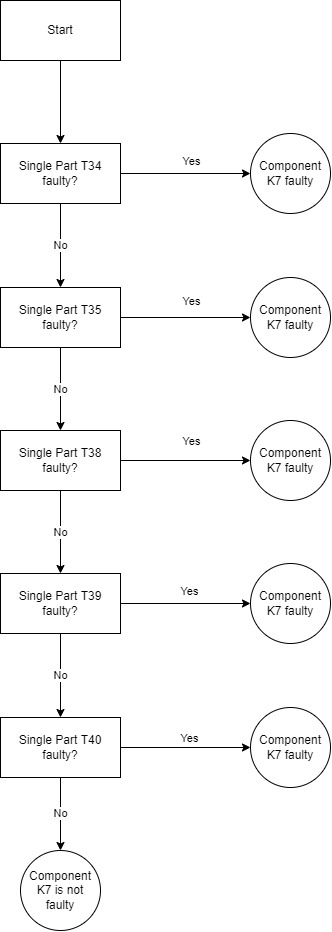

```{r setup, include=FALSE}
knitr::opts_chunk$set(echo = TRUE)
```

# Include Packages
```{r, , message = FALSE, echo = FALSE}
if (!require(install.load)) {
  install.packages("install.load")
}
library(install.load)
install_load(
  "tidyverse",
  "dplyr",
  "tidyr",
  "stringr",
  "readr",
  "knitr",
  "here",
  "ggplot2",
  "fitdistrplus",
  "plotly",
  "actuar"
)
print("Successfully loaded all packages!"
)
```


# Question 1

Logistics plays a more and more important role in the product development of the automobile industry. Parts produced by the supplier must first be delivered to the OEM before they can be installed. What seems logical at first sight should be analyzed in more detailed way for a professional application. Therefore, create a distribution for the logistics delay of component „K7”. Use the production date (“Produktionsdatum”) from the data set “Komponente_K7.csv” and the receiving date of incoming goods (“Wareneingang”) from “Logistikverzug_K7.csv” (logistics delay). You can assume that produced goods are issued one day after production date. For the model design in R, create a new data set “Logistics delay” that contains the required information from both data sets.

a) How is the logistics delay distributed? Justify your choice with statistical tests and briefly describe your approach.

Specification of distribution from data (based on https://www.r-project.org/conferences/useR-2009/slides/Delignette-Muller+Pouillot+Denis.pdf)
   1. Choose among a family of distributions the best candidates
   2. Estimate the distribution parameters and their uncertainty
   3. Assess and compate the goodness-of-fit of several distributions

We start by importing the data, calculating the logistics delay and examining the data in a plot.

```{r, warning=FALSE,message=FALSE}
# Import data which includes production date
komponenten_k7 <-
  read.csv2(here("Data", "Logistikverzug", "Komponente_K7.csv"))

# Import data which includes receiving date
logistikverzug_k7 <-
  read.csv(here("Data", "Logistikverzug", "Logistikverzug_K7.csv"))

# Merge tables by IDNummber (id number)
res <- merge(komponenten_k7, logistikverzug_k7, by = "IDNummer")

# Convert to dates in order to be able to calculate difference in days. Plus determination of weekday to consider weekends.
logistics_delay <-
  data.frame(
    IDNummer = res$IDNummer,
    Produktionsdatum = as.Date(res$Produktionsdatum),
    Wareneingang = as.Date(res$Wareneingang),
    PWD = as.POSIXlt(res$Produktionsdatum)$wday
  )

# Calculate date difference without weekends -> help function
date_diff_excluding_wekeends <- function(x, y, z) {
  if (is.na(x) || is.na(y) || is.na(z))
    return(NA)
  diff <- difftime(y, x, units = "days")
  # Because logistics does not work during the weekend, all parts produced during the weekend are shipped on Mondays.
  # For Saturdays, we thus need to reduce the delay by two days.
  if (z == 6) {
    return (diff - 2)
  } else {
    # For Sundays and all other days, we reduce the delay by one day.
    return (diff - 1)
  }
}

# Vectorize function
date_diff_excluding_wekeends_V <-
  Vectorize(date_diff_excluding_wekeends)

# Mutate and calculate the delay
logistics_delay <- logistics_delay %>%
  mutate(Verzoegerung_in_Tagen = as.integer(
    date_diff_excluding_wekeends_V(
      logistics_delay$Produktionsdatum,
      logistics_delay$Wareneingang,
      logistics_delay$PWD
    )
  ))

delay_in_days <- logistics_delay$Verzoegerung_in_Tagen

# Draw histogram to see the distribution of how many components have been delivered with how much delay

fig <-
  plot_ly(
    x = delay_in_days,
    type = "histogram",
    nbinsx = 25,
    alpha = 0.8
  ) %>%
  layout(
    yaxis = list(title = "Number of components"),
    xaxis = list(title = "Logistics delay in days", tickmode = 'linear'),
    title = "Plot: Distribution of the logistics delay in days"
  )

fig
```

The logistics delay is a vector of discrete integers. We thus start with discrete distributions.

```{r, warning=FALSE,message=FALSE}
## Step 1: Generate skewness-kurtosis graph to choose distributions

descdist(delay_in_days, discrete = TRUE, boot = 100)


## Result: Negative Binomial, Normal and Poisson distributions might all somewhat fit.
## (Remark: Some of these distributions might not make sense in our use case based on their theories, but we ignore that here.)

## Step 2: Fit given distributions (Always norm the data to min = 0 because distributions start with 0)

# Src: https://www.youtube.com/watch?v=5klSpGC2puU

dists <- c("nbinom", "pois", "norm")
fit <- list()
for (i in 1:length(dists)) {
  if (dists[i] == "nbinom") {
    #fit by MLE
    fit[[i]] <-
      fitdist(delay_in_days - min(delay_in_days), dists[i])
  } else {
    fit[[i]] <-
      fitdist(delay_in_days - min(delay_in_days), dists[i], method = "mme")
  }
}

for (i in 1:length(dists)) {
  print(summary(fit[[i]]))
}

#Plot the results
par(mfrow = c(2, 2))
plot.legend <- dists
denscomp(fit, legendtext = plot.legend)
cdfcomp (fit, legendtext = plot.legend)
qqcomp  (fit, legendtext = plot.legend)
ppcomp  (fit, legendtext = plot.legend)

## Step 3: Assess goodness-of- fit

goodness_of_fit <- list()
for (i in 1:length(dists)) {
  goodness_of_fit[[i]] <- gofstat(fit[[i]], discrete = TRUE)
}

for (i in 1:length(dists)) {
  print(goodness_of_fit[[i]])
}

```

To make a choice about which distribution fits best, we make use of the integrated functionality of the "fitdistrplus"-package.
The gofstat function computes goodness-of-fit statistics automatically.
In the case of the discrete distributions, we have the Akaike information criterion (AIC) and the Bayesian information criterion (BIC) that help us with the choice.
Both criteria are related to another and are used for model selection, which is similar to our use case.
Very briefly speaking, a model is better if it's AIC and BIC values are lower.
Based on this, out of the discrete distributions the normal distribution fits the  best.
However, we are not entirely satisfied yet with the results and want to also examine continuous distributions.

```{r, warning=FALSE,message=FALSE}
## Step 1: Generate skewness-kurtosis graph to choose distributions

par(mfrow = c(1, 1))
descdist(delay_in_days, discrete = FALSE, boot = 100)

## Result: Most likely the logarthmic normal distribution fits best, but we also take in Weibull and the Normal distribution for a comparison.

## Step 2: Fit given distributions

dists <- c("lnorm", "weibull", "norm")
fit <- list()
for (i in 1:length(dists)) {
  if (dists[i] == "weibull") {
    # Src: https://stats.stackexchange.com/questions/441516/how-to-fit-weibull-distribution-using-mme-method-and-find-the-estimates-in-r
    # function to calculate sample raw moment
    memp  <-  function(x, order) {
      mean(x ^ order)
    }
    
    #fit by MME
    fit[[i]] <-
      fitdist(
        delay_in_days,
        dists[i],
        method = "mme",
        order = c(1, 2),
        memp = memp,
        start = list(shape = 6, scale = 6),
        lower = 0,
        upper = Inf
      )
  } else {
    fit[[i]] <- fitdist(delay_in_days, dists[i], method = "mme")
  }
}

for (i in 1:length(dists)) {
  print(summary(fit[[i]]))
}

#Plot the results
par(mfrow = c(2, 2))
plot.legend <- dists
denscomp(fit, legendtext = plot.legend)
cdfcomp (fit, legendtext = plot.legend)
qqcomp  (fit, legendtext = plot.legend)
ppcomp  (fit, legendtext = plot.legend)

## Step 3: Assess goodness-of- fit

goodness_of_fit <- list()
for (i in 1:length(dists)) {
  goodness_of_fit[[i]] <- gofstat(fit[[i]])
}

for (i in 1:length(dists)) {
  print(goodness_of_fit[[i]])
}

```

In the case of the continuous distributions, we have some more criteria to evaluate the goodness-of-fit.
However, in the first step we only consider the AIC and BIC to have a better comparison with the discrete distributions.
Out of the continuous distributions, the Logarithmic Normal distribution has the lowest AIC and BIC scores. 
It is also lower than in the case of the discrete Normal distribution. Hence, so far, this distribution fits the best.
To be sure, we further compare the continuous distributions amongst each other based on the
- Kolmogorov-Smirnov statistic 
- Cramer-von Mises statistic   
and - Anderson-Darling statistic,
which are all established goodness-of-fit criteria for continuous distributions. Here, we are also looking to minimize the values.
Again, the Logarithmic Normal distribution fits the best.

Thus, overall, we consider the Logarithmic Normal distribution to be the best choice to describe the empirical distribution of our data.


b) Determine the mean of the logistics delay (watch out for weekends). Please interpret this number and discuss possible alternatives.

```{r}
sprintf("On average, the logistics delay is %s days.",
        format(round(
          mean(logistics_delay$Verzoegerung_in_Tagen), 2
        ), nsmall = 2))
```
**Interpretation: **

The mean of a series of numbers, in this case specifically the arithmetic mean, is its average. This means for the logistics delay, that on average, the delivery of a good is delayed by this many days.
Now, the mean could be used as an estimation for future delays. However, this metric has some limitations.
For example, if the empirical numbers are very far apart and not many numbers are close to the mean, it is a bad predictor because the value of the mean is rarely going to occur in reality. Furthermore, even if most of the data is concentrated in a specific range, very far outliers can influence the mean in a way that is not a good representation of which values occur must of the time in reality.
Due to these limitations, especially the last one, there are other metrics that should be taken into consideration additionally. One of them is the median. The median determines the value in a dataset, which has the characteristic that half of all the values in the dataset are below it, and the other half are above. Outliers have a very limited influence on the median. In this sense, it reduces particularly this weakness of the arithmetic mean.
Besides that, there are other ways to calculate averages. Some of the more promiment ones are the geometric and harmonic means.
They all have certain advantages for specific use cases.

c) Visualize the distribution in an appropriate way by displaying the histogram and the density function using “plotly”. Please describe how you selected the size of the bins.
```{r, warning=FALSE,message=FALSE}
# calculate kernel density estimates for the delay
# choose smoothing bandwidth (standard derivation of the smoothing kernel) so that the density function doesn't over- or underfit
delay_density <- density(delay_in_days, bw = 0.5)

# plot histogram and density function
# since the delay in days is no continuous variable, but rather discrete values, we have as many bins as discrete values and the binwidth is 1
plot_ly(x = delay_in_days, type = "histogram", name = "Histogram") %>%
  add_trace(
    x = delay_density$x,
    y = delay_density$y,
    type = "scatter",
    mode = "lines",
    fill = "tozeroy",
    yaxis = "y2",
    name = "Density"
  ) %>%
  layout(yaxis2 = list(overlaying = "y", side = "right"))

```

Since the values in the data are discrete and there are not many different values in the dataset, we can set the number of bins in a way that each bin has a singular corresponding value. In our code the bin width is set implicitly.

d) Please describe how you proceed, if you have to create a decision tree, which is describing the classification problem to classify whether the component (K7) is defective (Fehlerhaft) or not? (Hint: You might want to work with visualizations.)

Decision Tree based on single part failure
Generally speaking, a way to safely determine that a component is faulty is to look at the single parts it is made of. If at least one of these single parts is faulty, it follows that the component as a whole is faulty. This logic can be shown in form of a decision tree.
The component in this case, component K7, is made up of the single parts T34, T35, T38, T39, and T40. The following decision tree results.



One possible approach to classification in machine learning would be binary logistical regression classification. Binary logistic regression is useful in the analysis of multiple factors influencing a negative/positive outcome, or any other classification where there are only two possible outcomes. Since we only have the outcomes 'Fehlerhaft' and 'Nicht Fehlerhaft', this concept can also be implemented for classification in R.

# Question 2

Why does it make sense to store the available data in separate files instead of saving everything in a huge table? Name at least four benefits. The available tables represent a typical data base structure. How is it called?

**Four Benefits: ** 

* **Accessibility: ** 
Structuring and storing data in separate files allows easier access and thus easier readability of the files. 
Compared to large data sets, the relevant information would have to be extracted. 
In the case of small files with adequate designations, the user has the possibility to read out the desired information in a targeted manner and to process it directly. This leads to the next benefit of performance. 

* **Performance / Operating time: ** 
By storing the files in small separate files, the access time to the files is significantly reduced. 
Reading or opening large files requires a lot of memory and operations of the computer. 
By dividing them into small files, it is possible to work with the files faster. 

* **Memory advantage: ** 
As announced in performance, reducing a large dataset to small seperate ones can also reduce storage space. 
Data sets that are not necessary or sensibly grouped can be swapped out or made accessible elsewhere, thus avoiding unnecessary memory consumption. 

* **Data integrity: ** 
Data integrity is the overall accuracy, completeness, and consistency of data. 
If unforeseen events or errors damage the integrity of the data, it is very costly to fix this in a large file. 
If separate files are used and integrity is violated there, the area to be processed is significantly limited. 
The small separate files can thus be recovered more quickly without the risk of violating new integrity in other data fields. 

**Typical database structure: ** 
Oracle defines relational databases as following. "A relational database is a type of database that stores and provides access to data points that are related to one another. Relational databases are based on the relational model, an intuitive, straightforward way of representing data in tables.In a relational database, each row in the table is a record with a unique ID called the key. The columns of the table hold attributes of the data, and each record usually has a value for each attribute, making it easy to establish the relationships among data points."
If we take a closer look at the datasets provided, we can understand the structure of the data relatively quickly.  As, for example, tasks 3 and 6 will show later, there are links between the individual data records, regardless of whether they are .txt or .csv files.  For example, in the list of registered cars we find a unique identifier, the key to work through the car's components on a smaller level.  These in turn contain unique identifiers to look at the individual parts of the components.
Consequently, there is a link between the data sets and it can be considered as a relational database.
Quelle: [Oracle](https://www.oracle.com/database/what-is-a-relational-database/)


# Question 3
How many of the parts T16 ended up in vehicles registered in Adelshofen?
````{r, warning=FALSE,message=FALSE}
# Pull IDs for relevant parts
txt_t16 <-
  readLines(here("Data", "Einzelteil", "Einzelteil_T16.txt"))
txt_t16 <- paste('"ID" | |', txt_t16)
txt_t16 <-
  gsub(x = txt_t16,
       pattern = "\\s\\|\\s\\|\\s",
       replacement = ",")
txt_t16 <- gsub(x = txt_t16,
                pattern = "\\s",
                replacement = "\n")
txt_t16 <- substring(txt_t16, 1, nchar(txt_t16) - 1)
df_t16 <- read_delim(I(txt_t16), delim = ",", trim_ws = TRUE)
df_t16 <- dplyr::select(df_t16,-1)
rm(txt_t16)
ids_t16 <- df_t16$ID_T16.x
rm(df_t16)

# Pull data about relevant cars
alle_zulassungen <-
  read.csv2(here("Data", "Zulassungen", "Zulassungen_alle_Fahrzeuge.csv"))
adelshofen_zulassungen <- alle_zulassungen %>%
  filter(alle_zulassungen$Gemeinden == "ADELSHOFEN")

# Pull data about which cars contain which components
Bestandteile_Fahrzeuge_OEM1_Typ11 <-
  read.csv2(here("Data", "Fahrzeug", "Bestandteile_Fahrzeuge_OEM1_Typ11.csv")) %>% dplyr::select(-1)
Bestandteile_Fahrzeuge_OEM1_Typ12 <-
  read.csv2(here("Data", "Fahrzeug", "Bestandteile_Fahrzeuge_OEM1_Typ12.csv")) %>% dplyr::select(-1)
Bestandteile_Fahrzeuge_OEM2_Typ21 <-
  read.csv2(here("Data", "Fahrzeug", "Bestandteile_Fahrzeuge_OEM2_Typ21.csv")) %>% dplyr::select(-1)
Bestandteile_Fahrzeuge_OEM2_Typ22 <-
  read.csv2(here("Data", "Fahrzeug", "Bestandteile_Fahrzeuge_OEM2_Typ22.csv")) %>% dplyr::select(-1)
Bestandteil_Fahrzeuge <-
  rbind(
    Bestandteile_Fahrzeuge_OEM1_Typ11,
    Bestandteile_Fahrzeuge_OEM1_Typ12,
    Bestandteile_Fahrzeuge_OEM2_Typ21,
    Bestandteile_Fahrzeuge_OEM2_Typ22
  )
rm(
  Bestandteile_Fahrzeuge_OEM1_Typ11,
  Bestandteile_Fahrzeuge_OEM1_Typ12,
  Bestandteile_Fahrzeuge_OEM2_Typ21,
  Bestandteile_Fahrzeuge_OEM2_Typ22
)

# First filter components that containt part T16 by looking at datasets
# Then importing relevant datasets
Bestandteile_Komponente_K2LE2 <-
  read.csv2(here("Data", "Komponente", "Bestandteile_Komponente_K2LE2.csv"))
Bestandteile_Komponente_K2ST2 <-
  read.csv2(here("Data", "Komponente", "Bestandteile_Komponente_K2ST2.csv"))
Bestandteile_Komponente_K2LE2 <-
  Bestandteile_Komponente_K2LE2 %>% dplyr::select(c("ID_T16", "ID_K2LE2")) %>% rename(ID_Komponente = ID_K2LE2)
Bestandteile_Komponente_K2ST2 <-
  Bestandteile_Komponente_K2ST2 %>% dplyr::select(c("ID_T16", "ID_K2ST2")) %>% rename(ID_Komponente = ID_K2ST2)
Bestandteile_Komponenten <-
  rbind(Bestandteile_Komponente_K2LE2,
        Bestandteile_Komponente_K2ST2)

Verbaute_T16 <- adelshofen_zulassungen %>%
  merge(Bestandteil_Fahrzeuge, by.x = "IDNummer", by.y = "ID_Fahrzeug") %>%
  merge(Bestandteile_Komponenten, by.x = "ID_Sitze", by.y = "ID_Komponente") %>%
  filter(ID_T16 %in% ids_t16)

Unique_Verbaute_T16 <- unique(Verbaute_T16$ID_T16)

Anzahl_Unique_Verbaute_T16 <- length(Unique_Verbaute_T16)
#  Angemeldete Fahrzeuge 1:1 Komponente in Fahrzeug 1:1 Einzelteil in Komponente

sprintf(
  "%s parts T16 ended up in vehicles registered in Adelshofen.",
  Anzahl_Unique_Verbaute_T16
)
```

On examining the data we found the following relationship:
There is max. 1 part T16 in the componens K2ST2 and K2LE2. Vehicles can contain either one K2ST2 or one K2LE2 component. Thus, there is a 1:1 relationship along this line. As a result, the number of T16 parts included in vehicles in Adelshofen equals the number of vehicles in Adelshofen that contain a T16 part.

# Question 4 
Which data types do the attributes of the registration table “Zulassungen_aller_Fahrzeuge” have? Put your answers into a table which is integrated into your Markdown document and describe the characteristics of the data type(s).
```{r echo=FALSE, results='asis', warning = FALSE}
# Pfad setzen -> CSV einlesen alle Zulassungen
#alle_zulassungen <- read.csv2(here("Data", "Zulassungen", "Zulassungen_alle_Fahrzeuge.csv"))

#Alle Zulassungen wurde bereits importiert!

# Check structure of alle_zulassungen
#str(alle_zulassungen)
#colnames(alle_zulassungen)
#attributes(alle_zulassungen)

#typeof(alle_zulassungen$IDNummer)
descrip_X = "The Integer data type is used for integer values.To store a value as an integer, we need to specify it as such. The integer data type is commonly used for discrete only values like unique ids.We can store as well as convert a value into an integer type using the as.integer() function. If the data consists of only numbers, like decimals,whole numbers, then we call it numeric data. In numeric data, the numbers can be positive or negative. If the data consists only of whole numbers, it is called as integer. Integers too may take negative or positive values. In the present example, the integer number 408097 serves as an example of an integer. -408097,52 would be an nummeric datatype for example."


descrip_IDNummer = "The character data type stores character values or strings. Strings in R can contain the alphabet, numbers, and symbols. The easiest way to denote that a value is of character type in R is to wrap the value inside single or double inverted commas. In the present case '11-1-11-1' is used as an ID number, which is splitted through '-'. Without the '-' the ID could be defined as an integer."

descrip_Gemeinde = "The character data type stores character values or strings. Strings in R can contain the alphabet, numbers, and symbols. The easiest way to denote that a value is of character type in R is to wrap the value inside single or double inverted commas. The column 'Gemeinden' contains all places where cars were registered. The city names are thus displayed as char."


descrip_Zulassung = "The character data type stores character values or strings.Strings in R can contain the alphabet, numbers, and symbols. The easiest way to denote that a value is of character type in R is to wrap the value inside single or double inverted commas. 'Zulassung' contains dates as characters. For calculating/working reasons the could be converted as.Dates() or as.POSIXct(), as seen in different tasks in this course."


help_df <- data.frame(
  Row_Name = colnames(alle_zulassungen),
  Data_Types = c(
    typeof(alle_zulassungen$X),
    typeof(alle_zulassungen$IDNummer),
    typeof(alle_zulassungen$Gemeinden),
    typeof(alle_zulassungen$Gemeinden)
  ),
  Examples = c(
    alle_zulassungen$X[1],
    alle_zulassungen$IDNummer[1],
    alle_zulassungen$Gemeinden[1],
    alle_zulassungen$Zulassung[1]
  ),
  Characteristics = c(
    descrip_X,
    descrip_IDNummer,
    descrip_Gemeinde,
    descrip_Zulassung
  )
)

knitr::kable(
  help_df,
  "pipe",
  caption = "Characteristics from attributes 'Zulassung aller Fahrzeuge'",
  align = c("l", "l", "l", "l"),
  col.names = c("Row name", "Data type", "Example", "Characteristics")
)
#help_df <- table(help_df)
#help_df
```

# Question 5 
You want to publish your application. Why does it make sense to store the records on the database of a server? Why can’t you store the records on your personal computer? What is an easy way to make your application available to your customers? Please name 4 aspects.

* **Accessibility: ** 
Servers have been optimized to make resources available remotely over the internet.  This allows people from all over the world or you can access the data remotely if it is on a server.  If you work in a development team, everyone involved can load the current data sets from the server at any time.

* **Availability: ** 
Due to the hardware used in a server, shutting down the hardware is only very rarely necessary, which means that many specialized providers offer almost 100% server runtime.  The data is therefore available at all times and is not dependent on the user who has stored the data locally.

* **Performance: ** 
By storing the data on a server, you have the ability to easily manage performance by scaling the server up or down as needed.  The local storage of the data leads to a limitation of the performance to the given technical units of the computer.  Thus, when providing a globally accessible application, the performance can always be adjusted.  In addition, the specialized server providers offer security packages that significantly simplify access management.

* **Backups: ** 
Another very important benefit of storing on a server is creating backups.  Of course, programming is not carried out at the same time as the application is live, but the server providers offer simple options for creating backups in order to protect the user in the event of damage and to restore the original data records.  The development teams also always have a uniform status of the current data sets. 

* **Addition: ** 
One of these many advantages is e.g. provided by the provider [Heroku](https://www.heroku.com) or [Shinyapps.io](https://www.http://shinyapps.io/) which allows to easily make your application, in our case R Shiny application, available worldwide.

# Question 6 
On 11.08.2010 there was a hit and run accident. There is no trace of the license plate of the car involved in the accident. The police asks for your help, as you work for the Federal Motor Transport Authority, and asks where the vehicle with the body part number “K5-112-1122-79” was registered.

````{r, message = FALSE, echo = FALSE, warning = FALSE}
# Startdatenpunkt
gesuchte_karosserie <- 'K5-112-1122-79'

# CSV einlesen alle Zulassungen - BEREITS IMPORTIERT
#alle_zulassungen <- read.csv2(here("Data", "Zulassungen", "Zulassungen_alle_Fahrzeuge.csv"))

# CSV einlesen Bestandteile Fahrzeuge OEM1
Bestandteile_Fahrzeuge_OEM1_Typ12 <-
  read.csv2(here("Data", "Fahrzeug", "Bestandteile_Fahrzeuge_OEM1_Typ12.csv"))


# Filtern nach gesuchter Karosserie und weitere Suche in Zulassungen
result_row <- Bestandteile_Fahrzeuge_OEM1_Typ12 %>%
  filter(ID_Karosserie == gesuchte_karosserie) %>%
  inner_join(alle_zulassungen, by.x = "ID_Fahrzeug", by.y = "IDNummer")

reformated_registration_date <-
  format(as.Date(result_row$Zulassung), "%d.%m.%Y")

sprintf(
  "The vehicle [%s] with the body part [%s] was registered on %s in %s.",
  result_row["IDNummer"],
  gesuchte_karosserie,
  reformated_registration_date,
  result_row["Gemeinden"]
)
```
